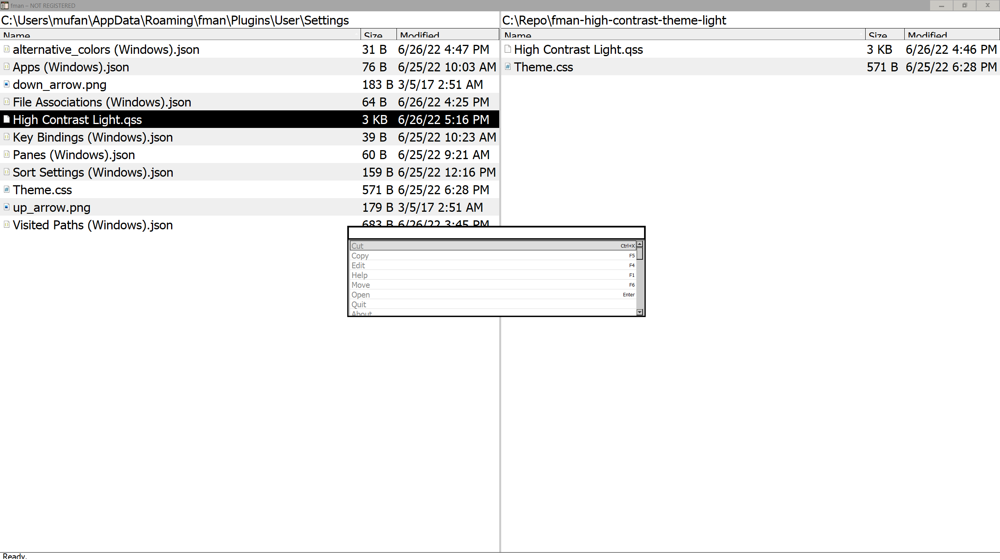

# Light high-contrast (E-Ink) theme for [fman](https://fman.io/)

> A light, high-contrast theme for [fman](https://fman.io/).
> Made to look and feel good when working with E-Ink monitors [Dasung Paperlike](http://www.dasungtech.com/)

## Install

You will need to manually replace the files as follows:

**styles.qss** goes in _C:\Users\your_username\AppData\Local\fman\Versions\your_version_

**theme.css** goes in _C:\Users\your_username\AppData\Local\fman\Versions\your_version\Plugins\Core_

If fman is updated, you will need to change the code again ¯\\\_(ツ)\_/¯

## License

[MIT License](./LICENSE)
